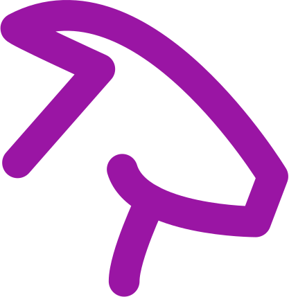

# Home

Welcome.  

My name is William Gay, and I'm an engineer at [Opto Investments](https://www.optoinvest.com/){:target="_blank"}. We believe the [private markets](https://en.wikipedia.org/wiki/Private_market_assets){:target="_blank"} are broken. Investment decisions and capital allocation relies heavily on PDFs and handshakes. At Opto, we're building technology that transforms how fiduciaries evaluate opportunities, allocate capital, and manage their portfolios.  

Previously, I was a CS Master's student at [Georgia Tech](https://www.scs.gatech.edu/){:target="_blank"} in the AI Virtual Assitant (AVA) Lab advised by [Professor Larry Heck](https://larryheck.github.io/){:target="_blank"}. I spent time working on machine learning for conversational AI.  

When I am not working, I watch a lot of [documentaries and films](https://williamgay25.github.io/interests.html). Feel free to reach out to connect at [william@optoinvest.com](mailto:william@optoinvest.com).  

[Interests](interests.md)  
[Publications](publications.md)  
[Links](links.md)  

{:target="_blank"}
{:target="_blank"}
<!-- {:target="_blank"} -->
{:target="_blank"}
{:target="_blank"}
