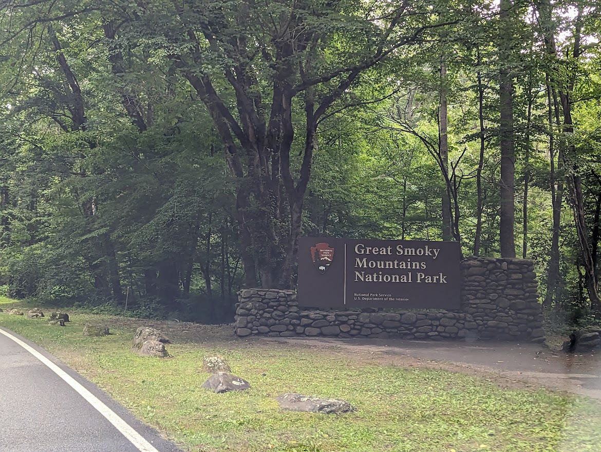
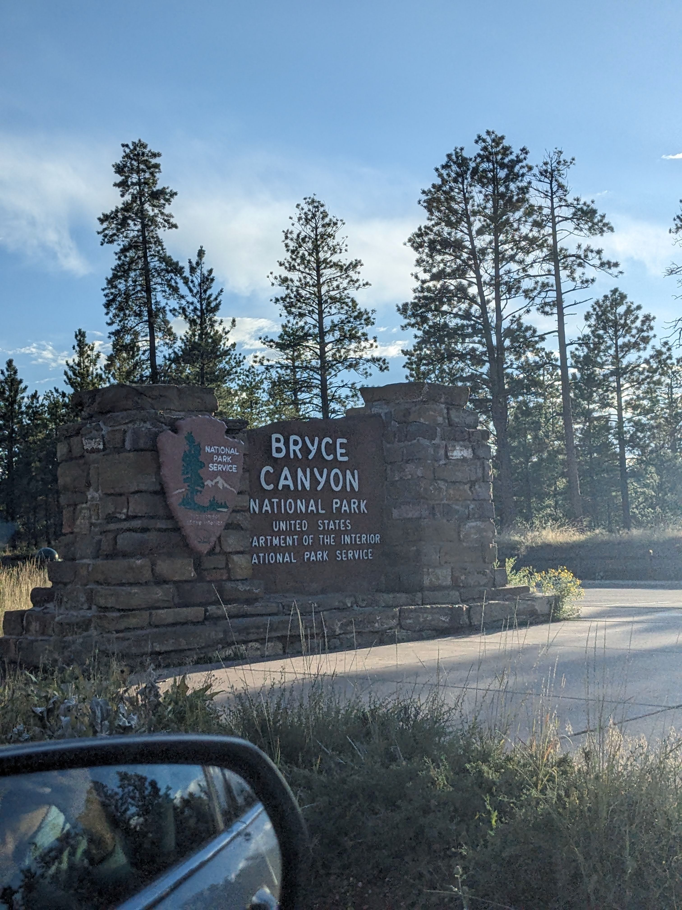

I'm into Age of Empires 2 and Formula 1. I also like to visit National Parks in the US whenever I get a chance. Here is a list of all the National Parks I've visited since starting my PhD:

Mount Rainier National Park  

Mammoth Cave National Park  

Pinnacles National Park  

Great Smoky Mountains National Park  

Zion National Park  

Bryce Canyon National Park  

[Back](https://anirudhssundar.github.io/)
